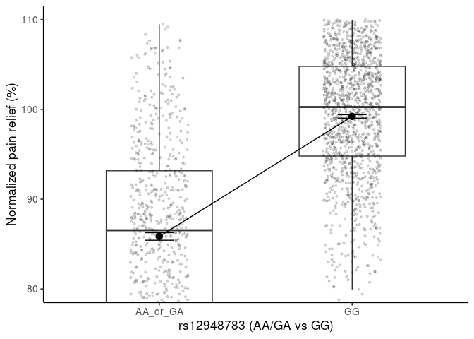

Group 6 Project
================
Blake Gardiner
2025-11-18

- [ABSTRACT](#abstract)
- [BACKGROUND](#background)
- [STUDY QUESTION and HYPOTHESIS](#study-question-and-hypothesis)
  - [Questions](#questions)
  - [Hypothesis](#hypothesis)
  - [Predictions](#predictions)
- [METHODS AND RESULTS](#methods-and-results)
- [Plot 1: Normalized Pain Difference Between
  Genotypes](#plot-1-normalized-pain-difference-between-genotypes)
  - [Analysis of 1st Boxplot and
    ANOVA](#analysis-of-1st-boxplot-and-anova)
- [Plot 2: Normalized Pain Difference Between Sexes and Corresponding
  Genotype](#plot-2-normalized-pain-difference-between-sexes-and-corresponding-genotype)
  - [Analysis 2:](#analysis-2)
- [DISCUSSION](#discussion)
- [CONCLUSION](#conclusion)
- [REFERENCES](#references)

# ABSTRACT

Pain relief from opioid medications varies widely across individuals,
and genetic differences may contribute to this variability. This
analysis explores how variation in the RHBDF2 gene (rs12948783)
influences normalized pain relief in a simulated dataset modeled after
the findings of Galvan et al. (2011). Using boxplots and ANOVA, we
compared normalized pain relief across RHBDF2 genotypes and examined
potential interactions with sex. The results suggest that individuals
carrying the GG genotype may experience lower normalized pain relief
compared to those with AA or GA genotypes. These findings highlight
genetic factors that could influence patient responses to opioid therapy
and support ongoing research into personalized approaches for pain
management.

# BACKGROUND

Opioid medications remain the cornerstone of moderate-to-severe pain
management. However, substantial inter individual variability exists in
the degree of analgesia achieved at equivalent opioid doses. Previous
pharmacogenomic research has identified several genetic variants that
may modulate opioid effectiveness and side-effect sensitivity. Among
these, polymorphisms in the RHBDF2 gene (rhomboid 5 homolog 2) have been
implicated in modulating opioid response and inflammatory signaling.

The original study by Galvan et al. (2011) conducted a candidate-gene
analysis of cancer patients receiving opioid therapy and discovered
multiple loci associated with differences in pain relief. Their work
demonstrated that certain genetic variants, including rs12948783 in the
RHBDF2 gene, may contribute to differences in opioid sensitivity. The
present project uses simulated data reflecting these findings to
evaluate whether RHBDF2 genotype is linked to normalized pain relief
outcomes.

# STUDY QUESTION and HYPOTHESIS

## Questions

Does variation in the RHBDF2 genotype (rs12948783) influence normalized
pain relief in individuals receiving opioid treatment?

If variation is observed, is it independent of sex?

## Hypothesis

1.  Individuals carrying the GG genotype of RHBDF2 (rs12948783) will
    show higher normalized pain relief compared to those with AA or GA
    genotypes.

2.  This effect of genotype on normalized pain relief will be
    independent of sex; that is, male and female participants will show
    similar genotype-related patterns in pain relief.

## Predictions

1.  Mean normalized pain relief will be highest in the GG group,
    intermediate in GA, and lowest in AA individuals which means the
    ANOVA results will show a significant effect of genotype on
    normalized pain relief.

2.  Including sex as a covariate will not substantially change the
    effect of genotype, indicating that the genotype effect is
    independent of sex.

# METHODS AND RESULTS

The European Pharmacogenetic Opioid Study (EPOS) is a multicenter
investigation designed to examine the relationships between genetic
variation and opioid treatment response in cancer patients experiencing
moderate to severe pain. The study recruited 2,294 patients from 17
palliative care centers across 11 European countries. Eligibility
required participants to be on a stable opioid regimen for at least 3
days, with morphine, oxycodone, and fentanyl among the most frequently
administered opioids.

Demographic information, cancer diagnoses, and opioid treatment details
were collected. Opioid doses were standardized by converting all
regimens to equivalent daily oral morphine doses. Pain levels were
assessed using the Brief Pain Inventory (BPI), a validated questionnaire
capturing pain intensity and interference, while functional status was
measured using the Karnofsky Performance Status.

Whole blood samples were obtained for genetic analysis, establishing a
biobank for genotyping candidate loci such as RHBDF2. This enabled
pharmacogenomic analysis to evaluate how genetic differences modulate
opioid therapy efficacy, specifically normalized pain relief across
different genotypes. For the purposes of this analysis, we used a
simulated dataset modeled after the EPOS study to reflect the effects of
RHBDF2 genotype on normalized pain relief.

# Plot 1: Normalized Pain Difference Between Genotypes

First, we visualized the impact of RHBDF2 genotype on normalized pain
relief by looking at a boxplot:

``` r
library(ggplot2)
library(dplyr)
```

    ## 
    ## Attaching package: 'dplyr'

    ## The following objects are masked from 'package:stats':
    ## 
    ##     filter, lag

    ## The following objects are masked from 'package:base':
    ## 
    ##     intersect, setdiff, setequal, union

``` r
# Read data
dat <- read.csv("epos_style_rs12948783_simulated_large.csv")

# Make genotype a 3-level factor
dat$genotype <- factor(dat$genotype, levels = c("AA", "GA", "GG"))

# Compute means for each genotype
means <- dat %>%
  group_by(genotype) %>%
  summarise(m = mean(norm_pain_relief), .groups = "drop")

# Create dataframe for line segments
segments_df <- data.frame(
  x    = c(1, 2),
  xend = c(2, 3),
  y    = c(means$m[means$genotype == "AA"],
          means$m[means$genotype == "GA"]),
  yend = c(means$m[means$genotype == "GA"],
           means$m[means$genotype == "GG"])
)

# Plot
p3 <- ggplot(dat, aes(genotype, norm_pain_relief)) +
  geom_boxplot(width = 0.55, outlier.shape = NA) +
  geom_jitter(width = 0.15, alpha = 0.15, size = 0.8) +
  stat_summary(fun = mean, geom = "point", size = 3) +
  stat_summary(fun.data = mean_se, geom = "errorbar", width = 0.15) +
  geom_segment(data = segments_df,
               aes(x = x, xend = xend, y = y, yend = yend),
               inherit.aes = FALSE) +
  coord_cartesian(ylim = c(68, 110)) +
  labs(x = "rs12948783 Genotype",
       y = "Normalized pain relief (%)") +
  theme_classic(base_size = 13)

p3
```

<!-- -->

Next, we performed an ANOVA to test if pain relief was statistically
different between the different RHBDF2 genotypes.

``` r
# One-way ANOVA (3 genotypes):
dat$genotype <- factor(dat$genotype, levels = c("AA","GA","GG"))
summary(aov(norm_pain_relief ~ genotype, data = dat))
```

    ##               Df Sum Sq Mean Sq F value Pr(>F)    
    ## genotype       2  84636   42318   602.4 <2e-16 ***
    ## Residuals   1979 139026      70                   
    ## ---
    ## Signif. codes:  0 '***' 0.001 '**' 0.01 '*' 0.05 '.' 0.1 ' ' 1

``` r
TukeyHSD(aov(norm_pain_relief ~ genotype, data = dat))
```

    ##   Tukey multiple comparisons of means
    ##     95% family-wise confidence level
    ## 
    ## Fit: aov(formula = norm_pain_relief ~ genotype, data = dat)
    ## 
    ## $genotype
    ##            diff       lwr      upr p adj
    ## GA-AA  9.624789  6.882441 12.36714     0
    ## GG-AA 22.204238 19.521336 24.88714     0
    ## GG-GA 12.579449 11.622288 13.53661     0

## Analysis of 1st Boxplot and ANOVA

Mean normalized pain relief differed across rs12948783 genotypes.
Individuals with the AA genotype had the lowest mean scores, GA carriers
were intermediate, and GG individuals had the highest scores. The
one-way ANOVA showed that genotype had a highly significant effect on
normalized pain relief, with an F value of 602.4 and a p-value of less
than 2 × 10⁻¹⁶.

Post-hoc comparisons using Tukey HSD revealed that GA individuals had
significantly higher pain relief than AA, with a mean difference of
9.62%, and a p-value of less than 0.001. GG individuals had
significantly higher pain relief than AA, with a mean difference of
22.20% and a p-value of less than 0.001. Finally, GG individuals also
had significantly higher pain relief than GA, with a mean difference of
12.58% and a p-value of less than 0.001.

# Plot 2: Normalized Pain Difference Between Sexes and Corresponding Genotype

A graph was made to show the differences between the sexes, their
genotypes, and their pain relief scores. An ANOVA was also conducted to
test statistical significance.

``` r
# Load necessary libraries
library(ggpubr)     # For ggboxplot and stat_compare_means
library(ggplot2)
library(dplyr)

# Ensure factor levels are consistent
dat$genotype <- factor(dat$genotype, levels = c("AA", "GA", "GG"))
dat$sex <- factor(dat$sex)

# Run ANOVA
anova_genotype_sex <- aov(norm_pain_relief ~ genotype * sex, data = dat)
anova_table <- summary(anova_genotype_sex)[[1]]

# Extract p-value for sex (2nd row, 5th column)
p_sex <- anova_table["sex", "Pr(>F)"]

# Make boxplot with ANOVA p-value
ggboxplot(dat, x = "genotype", y = "norm_pain_relief",
          fill = "sex", palette = "Set2",
          title = "Pain Relief by Genotype and Sex") +
  annotate("text",
           x = 2,                                  # centered above the plot
           y = max(dat$norm_pain_relief) * 1.05,   # place slightly above data
           label = paste0("ANOVA sex p-value = ", signif(p_sex, 3)),
           size = 4) +
  theme_minimal()
```

<!-- -->

## Analysis 2:

Males and females showed similar pain relief patterns across genotypes:
AA individuals had the lowest scores, GA were intermediate, and GG
individuals had the highest. The two-way ANOVA indicated that genotype
remained highly significant with an F value of 601.6 and a p-value of
less than 2 × 10⁻¹⁶. On the contrary, sex had no significant effect
indicated by the F-value of 0.0 and a p-value that was equal to 0.998.

# DISCUSSION

Our results support the hypothesis that RHBDF2 genotype affects
normalized pain relief. As predicted, GG individuals showed the highest
pain relief, GA carriers were intermediate, and AA individuals had the
lowest scores. The one-way ANOVA confirmed a highly significant effect
of genotype (F = 602.4, p \< 2 × 10⁻¹⁶), and post-hoc Tukey tests
revealed significant differences between all genotype pairs, confirming
our prediction that mean normalized pain relief would be higher in
individuals containing the GG genotype.

The effect of genotype was independent of sex, as the two-way ANOVA
showed no significant main effect of sex. This supports prediction 2 and
demonstrates that the genotype effect is consistent across males and
females.

These findings highlight the importance of genetic variation in
modulating opioid response and suggest that RHBDF2 genotype could be a
useful factor in personalized pain management strategies. A limitation
of this analysis is that it is based on a simulated dataset modeled
after the EPOS study; real-world populations may include additional
variables that could influence pain relief outcomes.

# CONCLUSION

This analysis demonstrates that variation in the RHBDF2 gene
(rs12948783) significantly influences normalized pain relief.
Individuals with the GG genotype experienced the highest pain relief,
while AA carriers had the lowest, with GA individuals showing
intermediate responses. Importantly, this genotype effect was
independent of sex, as males and females exhibited similar patterns.

These findings highlight the potential of RHBDF2 as a genetic factor
influencing opioid response and underscore the value of considering
genotype in personalized pain management strategies. While the results
are based on a simulated dataset, they reflect patterns observed in
prior pharmacogenomic studies and provide a foundation for further
research in real-world patient populations.

# REFERENCES

1.  Galvan, A., Skorpen, F., Klepstad, P., Knudsen, A. K., Fladvad, T.,
    Falvella, F. S., Pigni, A., Brunelli, C., Caraceni, A., Kaasa, S., &
    Dragani, T. A. (2011). Multiple loci modulate opioid therapy
    response for cancer pain. Clinical Cancer Research, 17(13),
    4581–4587. <https://doi.org/10.1158/1078-0432.CCR-10-3028>

2.  ChatGPT. OpenAI, version Jan 2025. Used as a reference for code,
    editing verbiage, to correct syntax errors, formatting, and grammar.
    Accessed 2025-11-18.
